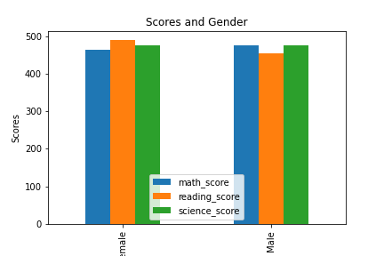
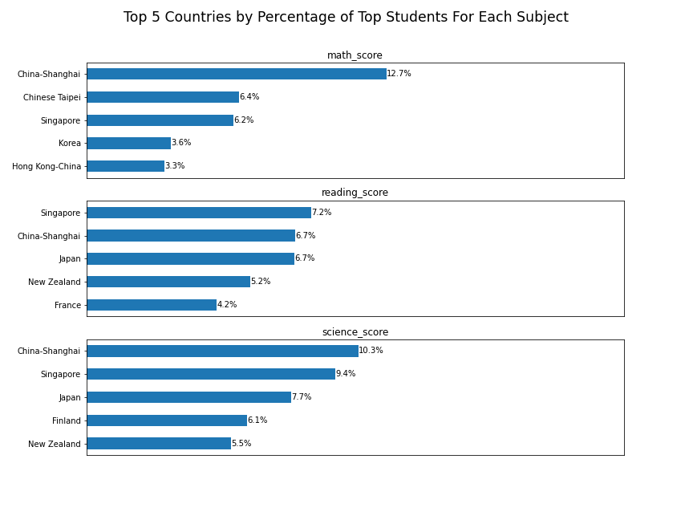

# PISA 2012 Data Analysis & Visualization
## by Amira Noaman

## Dataset

PISA is a survey of students' skills and knowledge as they approach the end of compulsory education. The aim of this test is to examine how well students have digested the school curriculum and how well prepared they are for life beyond school. Approximately a half million students in 65 economies joined the PISA 2012 assessment of reading, mathematics and science representing about 28 million 15-year-olds globally.

The original dataset contained information about 485,490 students and presents 636 features. The amount of features was huge so I decided to select some of them to build my analysis. I selected 8 features and my aim is to focus on the effect of multiple features on the scores of Math, Science & Reading.

## Summary of Findings

1. All scores appear normally distributed with a peak around 500
1. The number of females & males are almost equal 
1. Wealth distribution is slightly left skewed. At the right side there are some outliers.
1. Most students are from Mexico & Italy
1. Concerning motivation: the graph is slightly left skewed indicating that the students are more likely to be motivated than demotivated which is a good sign
1. Clearly most students have internet and this makes sense since we're in the 21st century
1. Males consistently score better than female students
1. Males are more motivated than females
1. Motivation doesn't seem to be highly correlated with any of the different courses' scores
1. Singapore and China-Shanghai are competing for the first place except in the math subject where Chinese Taipei surpassed Singapore and ranked 2nd.
1. Successful students in common are successful in all subjects simultaneously
1. Wealth index has no effect on academic performance
1. Female students have higher reading scores on average
1. Male students are more clever in Math 
1. Male students have slightly higher wealth index on average
1. The internet possession has a high correlation with academic performance and wealth index
1. In Singapore and United Arab Emirates, females were the top performers in math not males as expected
1. Females are the world's top performers in reading
1. Males and females are competing together when it comes to Science.

## Key Insights for Presentation

I chose to present a slideshow on the main 5 features I was exploring which are: country, gender, wealth, internet possession & motivation.
I presented a comprehensive plot that describes the pattern between each feature and the impact on the score of each subject.

Here are 2 examples:

